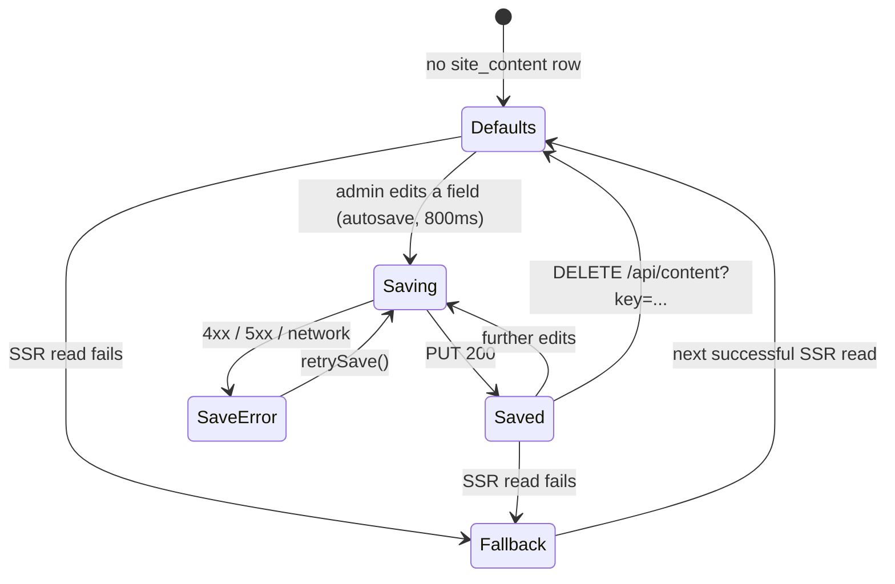

# Specification — Site content CMS: localStorage → Supabase

Status: **Draft, pending answers to "Open questions" (§12) before implementation.**
Author: product-architect · Date: 2026-09-04 · Target repo: EPILISSE (Next.js 15 + Supabase)
Related decision log entry: `DECISIONS.md` → ADR-001.

---

## 1. Problem

Every piece of editable site content except the theme is **client-side `localStorage` state**. Verified by grep over `src/` — 13 files touch `localStorage`, all of them CMS:

| localStorage key | Owner (write) | Reader (public) | Content |
|---|---|---|---|
| `epilisse_admin_categories` | `AdminDataContext` | `useAdminCategories` | Treatment categories (`laser`/`gesicht`/`mani` + admin-created `cat-*`) |
| `epilisse_admin_services` | `AdminDataContext` | `useAdminServices`, `useCategoryServices` | Services per category (name/price/duration/active) |
| `epilisse_admin_campaigns` | `AdminDataContext` | `useAdminCampaigns` | Campaign cards per category |
| `epilisse_admin_page_content` | `AdminDataContext` | `useAdminPageContent` | Service-page hero/info/benefits/2 banners per category |
| `epilisse_admin_settings` | `AdminDataContext` | `useAdminSettings` | Name, tagline, address, phone, email, WhatsApp, socials, Treatwell URL, `aboutImage`, opening hours |
| `epilisse_admin_landing_content` | `AdminDataContext` | `useAdminLandingContent` | Nav labels, section labels/titles, about copy, footer copy |
| `epilisse_admin_hero_slides` | `AdminDataContext` | `useAdminHeroSlides` | Homepage hero slides (max 10) |
| `epilisse_admin_promo_banners` | `AdminDataContext` | `useAdminPromoBanners` | Kombi-Angebot banners (max 4) |
| `epilisse_admin_about_values` | `AdminDataContext` | `useAdminAboutValues` | "Über Uns" Werte (max 10) |
| `epilisse_admin_reviews` | `AdminDataContext` | `useAdminReviews` | Treatwell reviews (max 24) |

Consequences, all confirmed:

1. An edit is visible **only in the browser that made it**. Editing on `localhost` never reaches `epilisse.vercel.app`; editing on the admin's laptop never reaches their phone or any visitor.
2. Confirmed live today: a custom category "Parmanent Make Up" created locally does not exist on the deployed site.
3. The admin panel is therefore **non-functional as a CMS**. It currently behaves as a per-browser preview tool.
4. Secondary defect this exposes: `POST /api/book` sends `categoryId` straight into `appointments.category_id`, which has a foreign key to the **DB** `categories` table (`0001_init.sql`, rows `laser/gesicht/body/inject/mani/andere`). An admin-created `cat-*` category has no such row, so **any booking on an admin-created category page fails with an FK violation.** This spec fixes it as part of the categories migration.

The one thing that already works correctly is the **theme** (`theme_settings`, migration `0018`), which is DB-backed and SSR-injected. This spec replicates that pattern for the rest of the content.

---

## 2. Goals / User Story

**Goal.** Make Supabase the single authoritative source for all admin-editable site content, so that any edit made by any admin, on any machine, is immediately what every visitor of the deployed site sees — with no loading flash, no blank render, and no change to the existing admin UI's look or interaction model.

**User Story.** *As the salon owner, I want the text, prices, categories, slides and contact details I change in the admin panel to appear on the live epilisse site for every visitor, so that the admin panel is the real CMS and I never have to ask a developer to deploy a copy change.*

Secondary story: *As a developer, I want one documented pattern (mirroring the theme editor) for DB-backed content, so future editable content is added the same way.*

---

## 3. Reference pattern (the theme) — what we replicate

Read and confirmed in the repo. The exact pattern to mirror:

1. **Table** (`supabase/migrations/0018_theme_settings.sql`): `theme_settings`, singleton `id = 1`, RLS **enabled**, one policy only:
   ```sql
   create policy "theme_settings public read" on theme_settings for select using (true);
   ```
   No insert/update policy at all — writes go through the service-role key, which bypasses RLS.
2. **Public read (SSR)** (`src/lib/theme/server.ts`): `'server-only'` module, anon client, `cache: 'no-store'` so an admin save is visible on the next request, and a **total-failure fallback** (missing env / missing table / network → `GOLD_LUX` preset) so the site always renders.
3. **Injection** (`src/app/[locale]/layout.tsx`): `await getServerTheme()` in the server layout; only emits the override `<style>` when the saved value differs from the default preset (`sameTheme(theme, GOLD_LUX)`), so a default site ships zero extra bytes and `style#theme-vars` is absent — asserted by `tests/e2e/theme.spec.ts`.
4. **Write path** (`src/app/api/theme/route.ts`): `GET` public, `PUT` gated on `await getAdminSession()` → 401, per-field validation (`isValidHex`) → 400, then `supabaseServer()` (service-role) update. **Admin session check inside the route handler is mandatory** — middleware alone is not sufficient.
5. **Admin editor** (`ThemeEditor.tsx`): fetch on mount → local editable copy + `saved` copy → dirty tracking → explicit "Kaydet" → on success `window.location.reload()` so SSR re-renders with the saved value. Loading state = a short "Tema yükleniyor…" panel.

Everything below stays inside this pattern. Deviations are called out explicitly.

---

## 4. Schema decision

### 4.1 Options evaluated

**Option A — one key/value JSONB table (`site_content`), one row per current localStorage key.**
- Pro: the DB shape mirrors the shape the code already produces and consumes, so `AdminDataContext`'s mutators and all the `merge*/str()` fallback helpers in the hooks survive unchanged. The diff is confined to ~4 new files + `AdminDataContext` + 11 hooks.
- Pro: one migration, one API route, one server reader; a section save is a single row upsert.
- Pro: no schema churn when a content type gains a field (e.g. a new `HeroSlide` property) — no migration needed.
- Con: no referential integrity (e.g. `page_content` keyed by a category id the DB does not enforce), last-write-wins at the whole-document level, no SQL queryability of individual items, and large rows when base64 images are embedded.

**Option B — normalized tables per content type** (`content_categories`, `content_services`, `content_page_content`, `hero_slides`, `promo_banners`, `about_values`, `reviews`, `landing_content`, `site_settings`).
- Pro: integrity (FK from services → categories), per-row writes so two admins editing different items never clobber each other, natural place for `sort_order`, easier targeted e2e seeding.
- Con: 9 tables + 9 API surfaces + a full rewrite of `AdminDataContext` and every admin page's data flow; the German default copy has to be re-expressed as SQL seed or an import script; a much larger, riskier change for a site with **one** editor.
- Con: the existing empty-string-means-fallback rule (`str()` in every hook, verified behaviour per project memory) would have to be re-implemented per column.

### 4.2 Recommendation — **Option A**, with two explicit reinforcements

Recommend **Option A**. Reasoning: the live defect is "content doesn't leave the browser", not "content isn't relational". Option A fixes the defect with a change small enough to review in one pass, preserves the already-tested fallback semantics, and keeps the theme pattern (single small table, public-read RLS, service-role writes). There is exactly one content editor, so document-level last-write-wins is acceptable. Option B remains a viable later refactor and is not foreclosed — the JSONB documents are a straight `insert … select jsonb_to_recordset(...)` away from normalized tables if white-label/multi-tenant ever needs it.

Reinforcements that remove Option A's two real risks:

- **R1 — category ↔ booking integrity.** The write route, whenever the `categories` document is saved, upserts `{id, name}` into the existing **`categories`** table (service-role, `on conflict (id) do update set name = excluded.name`). Rows are **never deleted** there, because `appointments.category_id` references them. This fixes the FK bug in §1.4 permanently.
- **R2 — payload size.** Server-side validation caps request and document size (§9), and image uploads keep their current base64 form only until Phase 3 moves them to Supabase Storage (§11, out of scope here).

### 4.3 Naming — collision warning

The DB **already has** `categories` (booking/CRM) and `campaigns` (email marketing) tables. The CMS's "categories" and "campaigns" are different things. To avoid ambiguity, CMS content is **never** given a top-level table of those names: it all lives under the single `site_content` table, keyed by `content_key`. Table/column names stay English per the project's existing DB naming rule.

### 4.4 Migration SQL

```sql
-- supabase/migrations/0019_site_content.sql
--
-- EPILISSE: admin-editable site content moved out of per-browser localStorage
-- into the DB, so an edit made by any admin is what every visitor sees.
-- Same shape as theme_settings (0018): public read via RLS, writes only through
-- the service-role key from a route handler that checks the admin session.
--
-- One row per content document. A MISSING row means "no admin has saved this
-- document yet" -> the app renders the code defaults in
-- src/app/[locale]/admin/behandlungen/data.ts (INIT_*/CATEGORIES). This is
-- deliberate: the German default copy stays in one place (TypeScript) instead of
-- being duplicated into SQL and drifting.

create table site_content (
  content_key text primary key,
  value       jsonb       not null,
  updated_at  timestamptz not null default now(),
  updated_by  uuid,                       -- auth.users.id of the admin who saved; nullable, informational only
  constraint site_content_key_allowed check (content_key in (
    'categories',
    'services',
    'campaigns',
    'page_content',
    'settings',
    'landing_content',
    'hero_slides',
    'promo_banners',
    'about_values',
    'reviews'
  ))
);

alter table site_content enable row level security;

-- The public site reads every document with the anon key during SSR
-- (src/lib/content/server.ts -> getServerSiteContent, called from
-- src/app/[locale]/layout.tsx). All of it is public page copy; nothing secret.
create policy "site_content public read"
  on site_content for select
  using (true);

-- No insert/update/delete policy: writes go through PUT /api/content with the
-- service-role key, gated on an admin session in the route handler.

-- No seed rows on purpose (see header comment).
```

`src/lib/supabase/database.types.ts` is hand-written in this repo; add the `site_content` entry there in the same style as `theme_settings`.

Also update two now-stale SQL comments (documentation only, no behaviour):
- `0001_init.sql:40` — "Services/prices live in the Behandlungen localStorage layer, not this DB" → point at `site_content`.
- `0018_theme_settings.sql:3-4` — "hero slides and page copy remain browser-local admin state" → no longer true after Phase 2.

---

## 5. Read path — SSR, not client fetch

**Decision: server-render the content, exactly like the theme. No client-side fetch, no loading skeleton on public pages.**

Justification:
- The public pages (`src/app/[locale]/page.tsx`, `[slug]/page.tsx`, the three service pages, `preise`, `behandlungen`, `ueber-uns`) are `'use client'`. Today they render *code defaults* on the server and swap to localStorage values in an effect. A client fetch would replace that instant swap with an async one — i.e. a visible flash of default copy, then a jump. Unacceptable for hero headlines and prices.
- Every one of those pages, and the whole admin area, is nested under `src/app/[locale]/layout.tsx`, which is already a **server** component and already does a `no-store` Supabase read for the theme. One more read there costs one round trip on a request that is already dynamic, and covers 100% of the surface.
- SEO: the copy ends up in the SSR HTML instead of only after hydration.

Implementation shape:

```
src/lib/content/
  types.ts       # ContentKey union, SiteContent type, per-key value types (re-exported from data.ts)
  defaults.ts    # buildDefaults(): SiteContent  — wraps CATEGORIES / INIT_* from admin/behandlungen/data.ts
  merge.ts       # mergeSiteContent(defaults, dbDocs): SiteContent — the existing str()/merge* rules, moved here
  validate.ts    # isValidDocument(key, value): boolean  — hand-written, mirrors isThemeInput (repo has no zod)
  server.ts      # 'server-only'  getServerSiteContent(): Promise<{ content: SiteContent; source: 'db' | 'fallback' }>
src/context/SiteContentContext.tsx   # 'use client' provider + useSiteContent()
```

- `getServerSiteContent()` — anon client, `cache: 'no-store'`, `select('content_key, value').` Any failure (no env, missing table, network) → `{ content: buildDefaults(), source: 'fallback' }`. Never throws.
- `[locale]/layout.tsx` wraps `children` in `<SiteContentProvider value={...}>` (inside `NextIntlClientProvider`, outside `BookingModalProvider`).
- **The merge/fallback rules move server-side unchanged.** Empty string in a saved field still means "not set → use the default", per the confirmed project rule (memory: `feedback_admin_empty_field_fallback`). `mergeSiteContent` is a pure function and must get unit tests, in the style of `src/lib/theme/derive.test.ts`.

---

## 6. Hook-by-hook change plan

Every public hook keeps **its exact current name, arguments and return type**, so no calling component changes. Each becomes a synchronous selector over `useSiteContent()`; the `useState` + `useEffect` + `localStorage` body is deleted.

| Hook | Signature (unchanged) | New body |
|---|---|---|
| `useAdminCategories` | `(): Category[]` | `useSiteContent().categories` |
| `useAdminServices` | `(catId: string, fallback: PricingItem[]): PricingItem[]` | filter `active` from `content.services[catId]`, apply existing `formatPrice`/`formatDuration`; if the result is empty return `fallback` (current behaviour) |
| `useCategoryServices` | `(categoryId: string): Service[]` | `content.services[categoryId] ?? []` filtered by `active` |
| `useAdminCampaigns` | `(catId: string): FrontendCampaign[]` | active `content.campaigns[catId]` mapped through the existing `toFrontend`; `resolveCampaigns` unchanged |
| `useAdminPageContent` | `(catId: string): PageContent` | `content.pageContent[catId]` (already merged server-side) |
| `useAdminSettings` | `(): SiteSettings` | `content.settings` |
| `useAdminLandingContent` | `(): LandingContent` | `content.landingContent` |
| `useAdminHeroSlides` | `(): HeroSlide[]` | `content.heroSlides` |
| `useAdminPromoBanners` | `(): PromoBanner[]` | `content.promoBanners` |
| `useAdminAboutValues` | `(): AboutValue[]` | `content.aboutValues` |
| `useAdminReviews` | `(): Review[]` | `content.reviews.filter(r => r.active)` (filter stays in the hook, as today) |

Consequential simplifications (do them, they are part of the change):

- `src/app/[locale]/[slug]/page.tsx` — the `hydrated` gate and its spinner exist only because localStorage was unavailable during SSR. With SSR content the category is known on the server, so **delete the `hydrated` state and the spinner branch**; "Seite nicht gefunden" then renders correctly on first paint.
- `src/app/[locale]/admin/behandlungen/store.ts` — module-level mutable `_services`/`_campaigns` duplicate state. Verify no remaining importer; if unused after the change, delete it.
- Legacy keys: on mount, `AdminDataProvider` removes the ten `epilisse_admin_*` keys from `localStorage` once, so a stale browser can never resurrect old content. One-liner, no UI.

### 6.1 `AdminDataContext` — write path

`AdminDataProvider` keeps its **entire public interface** (`services`, `categories`, `updateService`, `addCategory`, … — 30+ members). Only its internals change:

1. Initial state comes from `useSiteContent()` (server-provided), not from `INIT_*` + a localStorage effect.
2. Each mutator still updates local React state optimistically (so typing stays instant), then instead of `ls.write(KEY, next)` calls `queueSave(key, next)`.
3. `queueSave` — **debounced autosave**, 800 ms after the last change *per content key*, coalescing multiple keys into one `PUT /api/content` body. Flush immediately on `visibilitychange: hidden`, `beforeunload`, and on provider unmount.
4. Exposes save status for the UI: `saveStatus: 'idle' | 'saving' | 'saved' | 'error'` and `saveError: string | null`, plus `retrySave()`.

**Why autosave rather than the theme's explicit "Kaydet":** every admin page today mutates on each keystroke through these mutators. Explicit save would require rebuilding the form state of `startseite/page.tsx`, `einstellungen/page.tsx` and `behandlungen/[categoryId]/page.tsx` (all large). Autosave preserves those pages byte-for-byte and confines the diff to the context. `ThemeEditor` keeps its explicit-save model; the two coexist. *(This is the one deliberate deviation from the theme pattern — see open question Q2.)*

**Fallback lock (data-safety rule).** If `source === 'fallback'` (the SSR read failed), `AdminDataProvider` **disables all saving** and renders a persistent banner. Rationale: without this, a transient read failure would show defaults in the admin panel, and the first keystroke would autosave those defaults over the real DB content.

**Post-save freshness.** After a successful save the admin calls `router.refresh()` so the server layout re-reads and every other surface (e.g. the sidebar's `settings.name`) is consistent. No full reload — the theme's `window.location.reload()` is needed there only because CSS custom properties are injected at the `<html>` level.

---

## 7. API contract

### `GET /api/content`
Public. Returns the merged, ready-to-render content (defaults + saved documents), i.e. the same object the SSR reader produces. Used by e2e tests and as a debugging surface.

```
200 → {
  "content": { "categories": Category[], "services": Record<string, Service[]>, "campaigns": Record<string, Campaign[]>,
               "pageContent": Record<string, PageContent>, "settings": SiteSettings, "landingContent": LandingContent,
               "heroSlides": HeroSlide[], "promoBanners": PromoBanner[], "aboutValues": AboutValue[], "reviews": Review[] },
  "source": "db" | "fallback"
}
```
Never returns a non-200 for read failures — it degrades to `source: "fallback"` with defaults, matching `GET /api/theme`.

### `PUT /api/content`
Admin only. Upserts one or more whole documents atomically-enough (single multi-row `upsert`).

```
Request  { "documents": { "<contentKey>": <value>, ... } }      // 1..10 keys
200      { "ok": true, "updatedKeys": string[], "updatedAt": "<iso>" }
400      { "error": "Unbekannter Bereich: <key>" }              // key not in the whitelist
400      { "error": "<key> için geçersiz veri" }                // shape validation failed
401      { "error": "Unauthorized" }                            // getAdminSession() === null
413      { "error": "İçerik çok büyük (max <n> MB)" }           // size cap
500      { "error": "<supabase message>" }
```

Behaviour:
- `getAdminSession()` first; 401 before parsing.
- Per key: whitelist check → `isValidDocument(key, value)` → size check.
- Upsert `{ content_key, value, updated_at: now(), updated_by: session.user.id }` with `onConflict: 'content_key'`.
- **Side effect (R1):** if `documents.categories` is present, upsert `{id, name}` for each into the `categories` table. Never delete rows there. Log and 200 anyway if this side-upsert fails (content save must not be blocked by CRM bookkeeping), but include `"categorySyncWarning": string` in the response.

### `DELETE /api/content?key=<contentKey>`
Admin only. Deletes one document row → that section reverts to code defaults. Needed for a clean "Standard wiederherstellen" and for e2e reset. `200 { "ok": true }`.

---

## 8. Business rules

1. **DB is authoritative.** No component may read site content from `localStorage` after this change. `localStorage` is not kept as a cache.
2. **Missing row = code defaults.** An absent `site_content` row is a valid, expected state; it renders `CATEGORIES` / `INIT_*` from `src/app/[locale]/admin/behandlungen/data.ts`.
3. **First save materializes the whole document.** When an admin edits one field of a section, the full merged document (defaults + that edit) is written, so subsequent code-default changes no longer affect that section. Deliberate and matches today's localStorage behaviour.
4. **Empty string means "not set".** Preserved verbatim from today: a cleared admin field falls back to the default rather than rendering blank. Exception preserved: `HeroSlide.ctaLink === ''` is a *meaningful* value (opens the booking modal), never defaulted.
5. **Built-in categories are not deletable.** Unchanged rule: only `cat-*` ids can be deleted; `laser`/`gesicht`/`mani` cannot. The stale-id self-heal filter (`CATEGORIES.some(...) || id.startsWith('cat-')`) moves into `merge.ts` and keeps working against DB documents.
6. **Category ordering is insertion order, never alphabetical.** Unchanged; document order in the JSONB array is the display order.
7. **Category creation writes four documents** (`categories`, `page_content`, `services`, `campaigns`) — the existing `addCategory` template-cloning logic is unchanged, and all four keys go out in **one** `PUT` so a new category can never end up half-created.
8. **Every CMS category must exist in the `categories` table** (rule R1) before a booking can reference it.
9. **Limits are enforced server-side too**: `HERO_SLIDE_LIMIT` 10, `PROMO_BANNER_LIMIT` 4, `ABOUT_VALUE_LIMIT` 10, `REVIEW_LIMIT` 24, and the existing "at least 1" floors for slides/banners/values. Client-side limits stay as they are; the server repeats them.
10. **Last write wins, per document.** Two admins editing the same section concurrently: the later save overwrites. Accepted for now (single editor in practice).
11. **Opening hours have two homes and that stays true.** `business_hours` (DB, drives `/api/availability` slot computation) and `settings.hours` (display copy in the Kontakt section). `einstellungen/page.tsx` already writes both. After this change both writes are DB writes; the two-way sync logic there is unchanged. Unifying them is a **non-goal** here.
12. **Save failures never silently discard input.** On a failed autosave the local edit stays on screen, status goes `error`, and the banner offers `retrySave()`.

---

## 9. Validation

Per-document validators in `src/lib/content/validate.ts`, hand-written in the style of `isThemeInput` (no zod in this repo):

| Rule | Error |
|---|---|
| `content_key` ∈ whitelist (also a DB `check` constraint) | 400 `Unbekannter Bereich: <key>` |
| Value is a JSON array for `categories`/`hero_slides`/`promo_banners`/`about_values`/`reviews`; a JSON object for the rest | 400 `<key> için geçersiz veri` |
| Every element has the required keys with the right primitive types (e.g. `HeroSlide.duration` is a number ≥ 1) | 400 as above |
| `id` uniqueness within a document | 400 as above |
| Array length within the limits of rule 8 | 400 as above |
| Whole request body ≤ **4 MB**; a single document ≤ **3 MB** | 413 |
| Category id shape: built-in (`laser`/`gesicht`/`mani`) or `^cat-\d+$` | 400 |
| Unknown extra properties | stripped, not rejected (forward compatibility) |

Client-side, unchanged: the existing per-field UI constraints in the admin pages.

Error cases to handle explicitly:
- **SSR read fails** → site renders code defaults; admin shows the fallback banner and blocks saving (§6.1).
- **Save fails (network/500)** → status `error`, banner with the message and a retry button; edits kept on screen.
- **401 during save** (session expired mid-edit) → banner text "Oturum sona erdi — tekrar giriş yap", link to `/admin/login`; edits kept on screen.
- **413** → banner naming the likely cause (an uploaded image that is too large).

---

## 10. Permissions

| Actor | Read content | Write content |
|---|---|---|
| Anonymous visitor | Yes (RLS public select, anon key, SSR) | No |
| `admin` | Yes | Yes — all sections |
| `super_admin` | Yes | Yes — all sections |

- No per-section or per-role content restriction. `admin` and `super_admin` are equal for CMS content, exactly as they are for the theme.
- Enforcement is in the route handler via `getAdminSession()`, not in RLS — writes use the service-role key, which bypasses RLS. `SUPABASE_SERVICE_ROLE_KEY` must never be imported outside `src/app/api/**`.
- No new environment variables are required. `NEXT_PUBLIC_SUPABASE_URL`, `NEXT_PUBLIC_SUPABASE_ANON_KEY`, `SUPABASE_SERVICE_ROLE_KEY` are already set locally and on Vercel.

---

## 11. Migration & seeding plan

### 11.1 Baseline — flagged assumption, needs confirmation (Q1)

**Assumption taken from the brief:** existing `localStorage` content is **not** preserved. The DB starts empty; every section therefore renders the code defaults in `src/app/[locale]/admin/behandlungen/data.ts` — which is exactly what a fresh browser shows today, so for any visitor nothing changes at the moment of deployment.

**Risk this carries:** if the salon owner (or anyone) has typed real content into the admin panel in a browser that is still around, that content is lost the moment the hooks stop reading `localStorage`. This is invisible and irreversible.

**Cheap insurance, recommended:** before deploying Phase 1, on each browser that has been used for admin work, run a one-off export in the devtools console and keep the JSON:
```js
Object.fromEntries(Object.keys(localStorage).filter(k => k.startsWith('epilisse_admin_')).map(k => [k, JSON.parse(localStorage[k])]))
```
The result can be pasted straight into `PUT /api/content` after the migration (the document shapes are identical), so nothing needs to be retyped. If the user confirms nothing of value was ever entered, skip this.

### 11.2 Steps

1. Apply `supabase/migrations/0019_site_content.sql` (Supabase SQL editor, same as previous migrations in this project). No seed rows.
2. Add `site_content` to `src/lib/supabase/database.types.ts`.
3. Ship the code (phases below).
4. Post-deploy smoke: make one edit in production admin, verify in a fresh incognito window on a different device.
5. Backfill from a §11.1 export if the user has one.

### 11.3 Rollback

Revert the app deploy; the table can stay (nothing else references it). Because localStorage keys are only removed by the new code, a rollback lands on a browser whose keys were cleared — it falls back to code defaults, i.e. the same content the DB was serving. No data loss on rollback.

---

## 12. Phasing

Three deployable phases, in this order. Each is independently shippable and verifiable.

**Phase 1 — infrastructure + the categories/services domain (fixes the reported bug).**
`0019` migration · `src/lib/content/*` · `SiteContentContext` · wiring in `[locale]/layout.tsx` · `/api/content` (GET/PUT/DELETE) · category-sync side effect (R1) · flip `categories`, `services`, `campaigns`, `page_content` to DB · rewrite the four corresponding hooks + `useCategoryServices` · `AdminDataContext` autosave for those four keys (the other six keys keep writing localStorage in this phase) · delete the `hydrated` gate in `[slug]/page.tsx`.
*Why first:* it is the reported pain point ("Parmanent Make Up" missing on production), it carries the booking FK fix, and it exercises every piece of the new plumbing on the most complex documents. If the pattern is wrong, we find out here.

**Phase 2 — the remaining six documents.**
`settings`, `landing_content`, `hero_slides`, `promo_banners`, `about_values`, `reviews` → DB. Mechanical repetition of Phase 1 on simpler shapes. Ends with **zero** `localStorage` reads/writes for content in `src/`, plus the legacy-key cleanup.
*Why second, not merged into Phase 1:* it touches the homepage hero and the sitewide footer/nav labels. Keeping it out of the risky phase means a Phase 1 regression can be reverted without touching the homepage.

**Phase 3 — images out of the document body (separate spec, out of scope here).**
Admin uploads currently become **base64 data URLs stored inside the content** (`FileReader.readAsDataURL` in `einstellungen/page.tsx`, `startseite/page.tsx`, `behandlungen/[categoryId]/page.tsx`). In localStorage that was capped by the ~5 MB quota; in the DB it means multi-MB JSONB documents fetched on **every SSR request**, which will hurt TTFB well before it hurts storage. Phase 3 uploads to Supabase Storage and stores only the URL. Until then the size caps in §9 are the guard rail. **Do not start Phase 3 inside this spec's work.**

Not phased separately, but required with Phase 1: the SQL comment corrections in §4.4.

---

## 13. Testing impact (flagged, partly out of scope)

Current e2e admin specs (`admin-hero-slides-crud`, `admin-category-visibility`, `admin-settings-cms`, `admin-startseite-cms`, `admin-service-page-cms`, `admin-promo-banners-crud`, `admin-about-values-crud`, `admin-category-image-upload`) all rely on two things that this change invalidates:

1. **Per-test isolation via a fresh browser context.** `admin-hero-slides-crud.spec.ts` literally asserts "4 / 10" as the starting state because a fresh context has empty localStorage. Once content is global, tests mutate shared state and pollute each other and, worse, the real database of whatever environment they run against.
2. **Unauthenticated admin access.** These specs `page.goto('/de/admin/...')` with no login. Per the known open item, admin e2e has **no auth bypass at all** and the suite is already broken there. After this change the failure mode also changes: navigation still hits the middleware, and every autosave returns 401.

**Scope call:** the auth bypass is a pre-existing, separate concern and is **not** solved in this spec. What this spec requires is only:

- A `resetSiteContent()` helper in `tests/e2e/helpers.ts` that `DELETE`s all ten documents (restoring code defaults) via the API with a service-role/test credential, called in `beforeEach` for admin CRUD specs, and those files run `test.describe.configure({ mode: 'serial' })`.
- Admin CRUD specs are **explicitly quarantined** (`test.skip` with a `TODO: needs admin auth bypass — see e2e auth gap`) if the auth work has not landed when Phase 1 ships, rather than left silently red.
- E2E must never run against the production Supabase project. Guard: the reset helper refuses to run unless `NEXT_PUBLIC_SUPABASE_URL` matches a non-production project ref.
- Unaffected and must stay green: `public-smoke`, `theme`, `booking-modal`, `hero-scrub-video`.
- New unit tests: `src/lib/content/merge.test.ts` covering the empty-string fallback rule, the stale-built-in-category filter, and the `ctaLink: ''` exception.

---

## 14. States



Provider-level state, consumed by the admin UI:

| State | Public site shows | Admin shows | Saving |
|---|---|---|---|
| `db` + no row for key | code defaults | code defaults | enabled |
| `db` + row present | saved document (merged) | saved document | enabled |
| `fallback` (read failed) | code defaults | code defaults + error banner | **blocked** |
| `saving` | last SSR-rendered value | live local edit + "Kaydediliyor…" | in flight |
| `error` | last SSR-rendered value | live local edit + error banner + retry | blocked until retry |

---

## 15. Flow

**Admin edit (entry: logged-in admin on any `/[locale]/admin/*` page).**
1. Server layout reads all content documents → provider → `AdminDataProvider` initial state.
2. Admin types in a field. Local state updates instantly; the field's document is marked dirty.
3. 800 ms after the last keystroke, one `PUT /api/content` carries every dirty document.
4. Route handler: session check → validation → upsert → (if categories) sync `categories` table.
5. Status shows "Kaydedildi"; `router.refresh()` re-reads the server layout.
6. Exit: the admin navigates away (pending saves are flushed first) or closes the tab.

**Visitor read (entry: any public URL).**
1. Server layout reads theme + content in the same request.
2. Content is passed into the client tree; hooks return it synchronously.
3. First paint already contains the admin's copy. No flash, no skeleton.
4. Exit: normal navigation; a client-side route change reuses the provider without refetching.

**Failure (entry: Supabase unreachable at SSR).**
1. `getServerSiteContent()` catches, returns defaults with `source: 'fallback'`.
2. Public site renders defaults — visually correct, just not the latest edits.
3. Admin sees the banner and cannot save until a refresh succeeds.

---

## 16. Open questions — answer before implementation

1. **Q1 (blocking).** Confirm the §11.1 assumption: the DB is seeded from the **code defaults**, and any content currently sitting in someone's browser localStorage is discarded. Is there any browser with real content that should be exported first?
2. **Q2.** Autosave (debounced, 800 ms, no button — keeps every admin page untouched) vs. explicit per-section "Kaydet" like `ThemeEditor` (clearer, but requires rebuilding three large admin pages). Recommendation: autosave.
3. **Q3.** Confirm Option A (single `site_content` JSONB table) over Option B (9 normalized tables). Recommendation: Option A.
4. **Q4.** Confirm rule R1: saving categories also upserts them into the CRM `categories` table so bookings on admin-created categories stop failing. (Recommended — it is a live bug.)
5. **Q5.** Images stay as base64 inside the documents for Phases 1–2, with a 3 MB per-document cap, and move to Supabase Storage in a separate Phase 3 spec — confirm.
6. **Q6.** New admin status/error strings: the admin UI is mixed German (nav, forms) and Turkish (`ThemeEditor`). Which language for "Kaydediliyor…/Kaydedildi/Kaydedilemedi"? Recommendation: Turkish, matching `ThemeEditor`, since these strings are for the operator not the customer.

**Flagged as stale, not silently overridden:** the DB `categories` table still contains `body`, `inject` and `andere` rows, though those categories were removed from the CMS in commit `77a168e` and the `andere` removal on 2026-07-14. They must **not** be deleted (appointments may reference them), but the admin-facing category pickers in `/admin/kampagnen` and `/admin/kunden` may still surface them. Out of scope here — raising it so it is a conscious choice.

---

## 17. Acceptance criteria

Verifiable by the tester agent.

**Correctness of the fix**
1. An admin creates a new category in production admin; in a **fresh incognito window on a different device**, that category appears on `/de/behandlungen` and its `/de/cat-<id>` page renders. *(This is the exact scenario that fails today.)*
2. An admin changes a service price; the new price appears for an anonymous visitor within one page load, without clearing any cache.
3. Editing hero-slide headline / settings phone / a Treatwell review / an "Über Uns" Wert / landing footer copy all propagate the same way (Phase 2).
4. `view-source` of `/de` contains the admin-edited hero headline — proving it is server-rendered, not hydrated in.

**No regressions**
5. `grep -r "localStorage" src/` returns **no** content-CMS hits after Phase 2 (any remaining hits must be unrelated and justified).
6. A brand-new database (no `site_content` rows) renders the site byte-identically to today's default render.
7. Clearing a field in the admin still falls back to the default and never renders blank (rule 4).
8. `HeroSlide.ctaLink = ''` still opens the booking modal rather than defaulting to a URL.
9. Built-in categories still cannot be deleted; `cat-*` still can; category order is insertion order.
10. All existing limits (10 slides / 4 promos / 10 values / 24 reviews, and the "last one cannot be deleted" floors) hold, and are additionally enforced by the API (a crafted `PUT` exceeding them returns 400).
11. `style#theme-vars` behaviour and `tests/e2e/theme.spec.ts` are untouched and still pass.
12. Booking still works on every category page, **including an admin-created one** (previously an FK failure).

**Security**
13. `PUT /api/content` without a session → 401. With an expired session → 401. `DELETE` likewise.
14. `GET /api/content` works anonymously and exposes nothing beyond public page copy.
15. `SUPABASE_SERVICE_ROLE_KEY` appears in no client bundle (`grep` the build output).
16. RLS is enabled on `site_content` and the only policy is public select.

**Resilience / UX**
17. With Supabase unreachable (env var removed locally), the public site still renders defaults and does not error.
18. In the same condition the admin shows the fallback banner and **cannot** save.
19. A failed save keeps the typed value on screen and offers a retry; a successful retry persists it.
20. No loading spinner or content flash on any public page — copy is correct in the first paint (this is a visual check, not only a DOM assertion, per the project's "e2e must catch visual gaps" rule).

**Tests**
21. `merge.test.ts` covers the fallback rules and passes.
22. `public-smoke`, `theme`, `booking-modal`, `hero-scrub-video` pass.
23. Admin CRUD specs are either passing with the new reset helper, or explicitly quarantined with the auth-gap TODO — never silently failing.

---

## 18. Non-goals

- Multi-tenant / white-label content separation (no `tenant_id`). Deferred until a real second customer exists.
- Per-locale content. Content documents stay single-language German strings, as today.
- Normalizing content into relational tables (Option B).
- Moving image uploads to Supabase Storage (Phase 3, separate spec).
- Draft/publish workflow, content versioning, undo, audit trail beyond `updated_at` / `updated_by`.
- Optimistic locking / multi-editor conflict resolution.
- Unifying `business_hours` and `settings.hours` into one source.
- Fixing the admin e2e auth bypass gap.
- Any redesign of admin screens; layout and styling stay exactly as they are.
- Caching/ISR tuning of the SSR content read (`no-store` matches the theme; revisit only if TTFB regresses).

---

## 19. Definition of Done

- `supabase/migrations/0019_site_content.sql` committed **and applied** to the live Supabase project; `database.types.ts` updated.
- `src/lib/content/{types,defaults,merge,validate,server}.ts` and `src/context/SiteContentContext.tsx` exist, with `merge.test.ts` green.
- `/api/content` implements GET/PUT/DELETE per §7, including the category sync side effect.
- All eleven hooks in §6 rewritten with unchanged signatures; no calling component's props changed.
- `AdminDataContext` persists through the API with debounced autosave, save status, retry, and the fallback lock.
- No content path in `src/` reads or writes `localStorage`; legacy keys are cleaned up on admin mount.
- The `[slug]` hydration spinner and (if unused) `behandlungen/store.ts` are removed.
- Stale SQL comments in `0001` and `0018` corrected.
- All §17 acceptance criteria verified by the tester agent, on the deployed Vercel site and not only locally.
- `DECISIONS.md` ADR-001 moved from Proposed to Accepted, with any answers from §16 folded in.
- `npm run lint` and `npm run build` clean; the e2e suite in the state described in §17.23.
